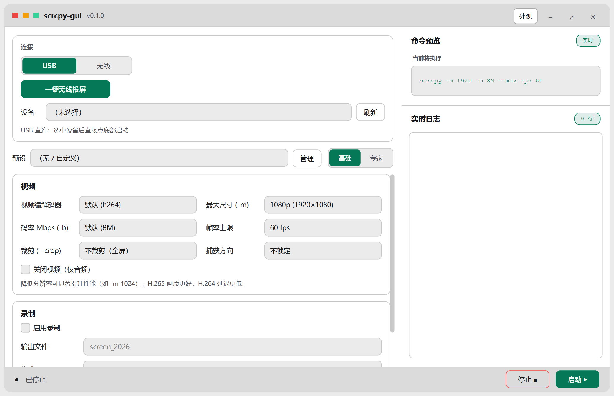

# scrcpy-gui

[English](README.en.md) | 简体中文

面向 Windows 的非官方 scrcpy 图形启动器。它把常用连接、画面、音频、控制、录制和窗口参数整理成可视化界面，同时保留实时命令预览和日志。

> 本项目与 Genymobile 无隶属或背书关系。镜像与控制能力由官方 [Genymobile/scrcpy](https://github.com/Genymobile/scrcpy) 提供。



## 功能

- 自动发现 USB 设备，显示未授权和离线状态
- USB 与无线 TCP/IP 投屏工作流
- 视频尺寸、码率、帧率、编解码器和裁剪参数
- 音频转发、输入控制、录制和窗口选项
- 基础/专家模式与 JSON 预设
- 实时 scrcpy 命令预览、运行日志和启动/停止控制
- 深浅色及自定义背景主题

## 普通用户

从 [Releases](https://github.com/A-BOT-GIT/scrcpy-gui/releases) 下载 `scrcpy-gui-v0.1.0-windows-x64.zip`，解压后运行 `scrcpy-gui.exe`。发布包已包含未经修改的官方 scrcpy v4.1 Windows x64 文件，不需要安装 Python。

使用前在 Android 设备上启用开发者选项和 USB 调试。首次连接时需在设备上确认调试授权。

## 源码运行

要求 Windows 10/11、Python 3.12+ 和 PowerShell 5.1+：

```powershell
git clone https://github.com/A-BOT-GIT/scrcpy-gui.git
cd scrcpy-gui
python -m venv .venv
.\.venv\Scripts\Activate.ps1
python -m pip install -r requirements-dev.txt
.\scripts\setup-scrcpy.ps1
python main.py
```

安装脚本固定下载官方 `scrcpy-win64-v4.1.zip` 并校验 SHA-256，验证通过后放入忽略版本控制的 `vendor/scrcpy`。也可设置 `SCRCPY_HOME` 指向已有的官方 scrcpy 目录，或把 `scrcpy` 与 `adb` 加入 PATH。

查找顺序：发布包目录、`SCRCPY_HOME`、`vendor/scrcpy`、项目根目录、PATH。

## 开发与构建

```powershell
python -m compileall -q app core ui workers main.py tests
python -m pytest
.\scripts\build-release.ps1 -Version 0.1.0
```

构建产物位于 `build/scrcpy-gui-v0.1.0-windows-x64.zip`，并生成对应 SHA-256 文件。

## 常见问题

**程序提示找不到 scrcpy 或 adb**

运行 `.\scripts\setup-scrcpy.ps1`，或配置 `SCRCPY_HOME`。

**设备列表为空**

确认 USB 调试已开启，运行 `adb devices -l` 检查连接，并在手机上接受授权。

**小米/红米设备无法控制**

部分机型还需开启“USB 调试（安全设置）”并重启设备。

**无线连接失败**

先通过 USB 完成授权，确保电脑和设备位于同一局域网，再执行一键无线投屏。

## 开源与第三方组件

scrcpy-gui 按 [Apache License 2.0](LICENSE) 发布。Windows Release 再分发官方 scrcpy v4.1，其版权与许可信息见 [THIRD_PARTY_NOTICES.md](THIRD_PARTY_NOTICES.md)。

贡献前请阅读 [CONTRIBUTING.md](CONTRIBUTING.md)。安全问题请按 [SECURITY.md](SECURITY.md) 私下报告。

## 当前限制

- 首版仅提供 Windows x64 发布包
- 摄像头投屏等较新的 scrcpy 功能尚未全部图形化
- 真实设备兼容性依赖设备厂商、Android 版本和官方 scrcpy
